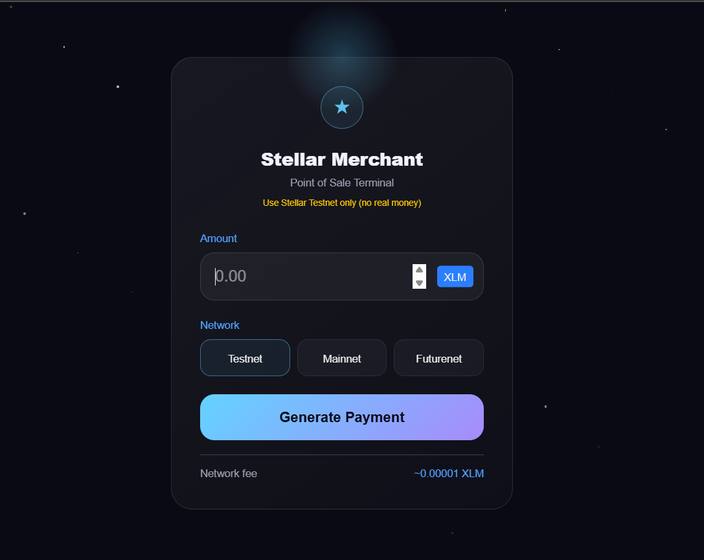
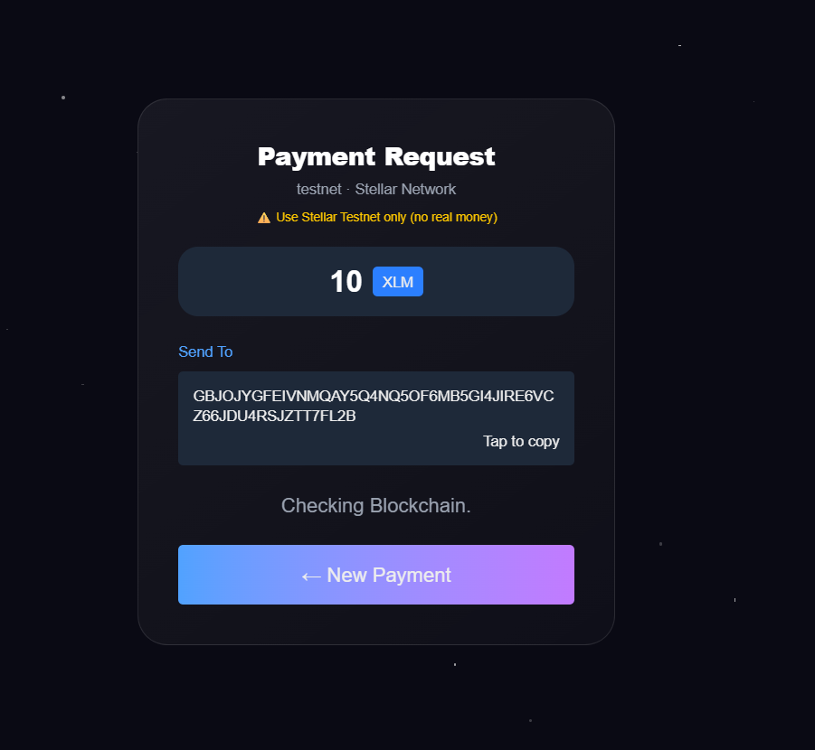
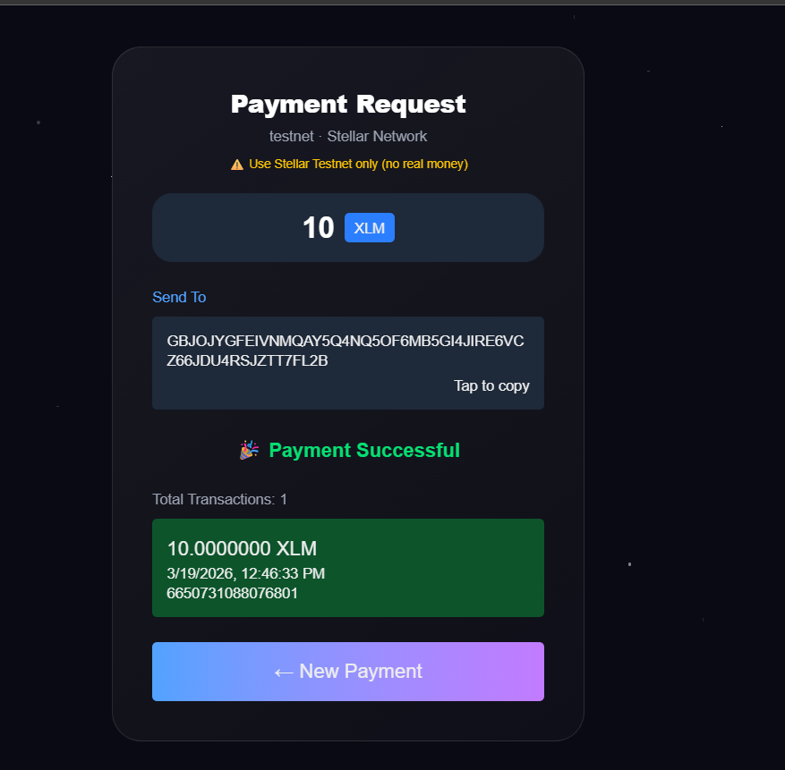

# 🚀 Stellar Merchant POS

## 🌟 Overview

Stellar Merchant POS is a modern **crypto point-of-sale system** built on the Stellar Network that allows merchants to accept payments in XLM instantly.

The application provides a clean, user-friendly interface where merchants can generate payment requests, and customers can send payments using their Stellar wallets. The system automatically detects transactions on-chain and confirms payments in real-time.

---

## ❗ Problem

Retail stores and small businesses lack simple tools to accept cryptocurrency payments. Existing blockchain systems are often complex, slow, and not designed for everyday merchant use.

---

## 💡 Solution

Stellar Merchant POS simplifies crypto payments by providing:

* A **simple payment interface**
* **Instant blockchain verification**
* A **real-time payment confirmation system**

This makes crypto payments as easy as UPI or card payments.

---

## ✨ Features

### 🔹 Core Features (Level 5)

* 💳 Generate payment requests
* 🌐 Real-time payment detection using Stellar blockchain
* ⚡ Instant transaction confirmation
* 📜 Transaction history display
* 📋 Copy wallet address functionality
* 🎯 Input validation (prevent invalid payments)
* 🎨 Premium UI (glassmorphism + animated stars)

---

### 🔹 UX Enhancements

* ⏳ Animated "Checking Blockchain" loader
* 🎉 Payment success feedback
* 📊 Transaction counter
* ⚠️ Testnet usage warning for users

---

### 🔹 Additional Improvements (Iteration)

* Added copy-to-clipboard for wallet address
* Improved UI clarity and design consistency
* Prevented duplicate transaction detection
* Enhanced success message visibility

---

## Architecture

Frontend (Next.js)
   ↓
Stellar Horizon API
   ↓
Stellar Blockchain
   ↓
Payment Detection Logic

## 🛠 Tech Stack

* **Frontend:** Next.js, React, Tailwind CSS
* **Blockchain:** Stellar Network (Horizon API)
* **Library:** stellar-sdk
* **Wallet:** Freighter Wallet

---

## 🏗 Architecture

User → Frontend (Next.js) → Stellar Network → Payment Detection

---

## 🌐 Live Demo

👉 https://your-app.vercel.app

---

## 🎥 Demo Video

👉 (Add your video link here)

---

## 📸 Screenshots

### 🔹 Home Page

### 🔹 Payment Request

### 🔹 Payment Success

---
 
## 👥 Test Users (Stellar Wallets)

1. GXXXXXXX1
2. GXXXXXXX2
3. GXXXXXXX3
4. GXXXXXXX4
5. GXXXXXXX5

---

## 💬 User Feedback

**User 1:** Easy to use and clean UI
**User 2:** Payment confirmation is fast
**User 3:** Suggested adding copy wallet button
**User 4:** UI looks modern and professional
**User 5:** Wanted clearer instructions for testnet

---

## 🔄 Iteration Based on Feedback

* Added "Tap to Copy" wallet feature
* Improved success message
* Added testnet warning
* Enhanced UI responsiveness

---

## 🚀 Future Enhancements (Level 6)

* 📊 Analytics dashboard (total revenue, transactions)
* 👥 Multi-merchant support
* 💸 Fee sponsorship (gasless payments)
* 🔐 Multi-signature payment approval
* 🌍 Cross-border payments integration
* 📡 Real-time transaction streaming
* 🗄 Database integration (Supabase)
* 📈 User metrics (DAU, retention)

---

## ⚠️ Note

This project uses **Stellar Testnet only**. No real funds are involved.

---

## 🏆 Conclusion

Stellar Merchant POS demonstrates how blockchain can be used in real-world retail scenarios to enable fast, secure, and user-friendly crypto payments.

---
