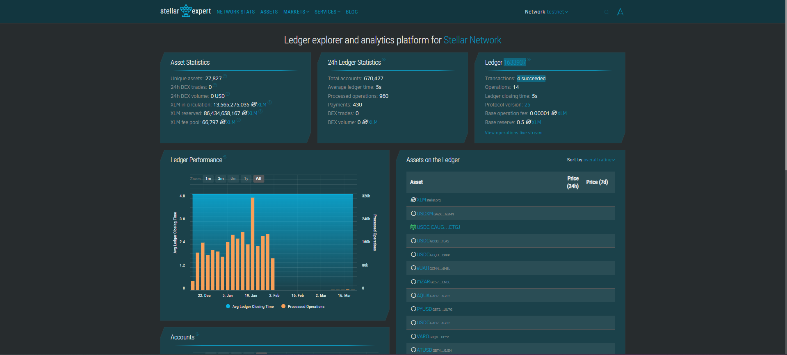
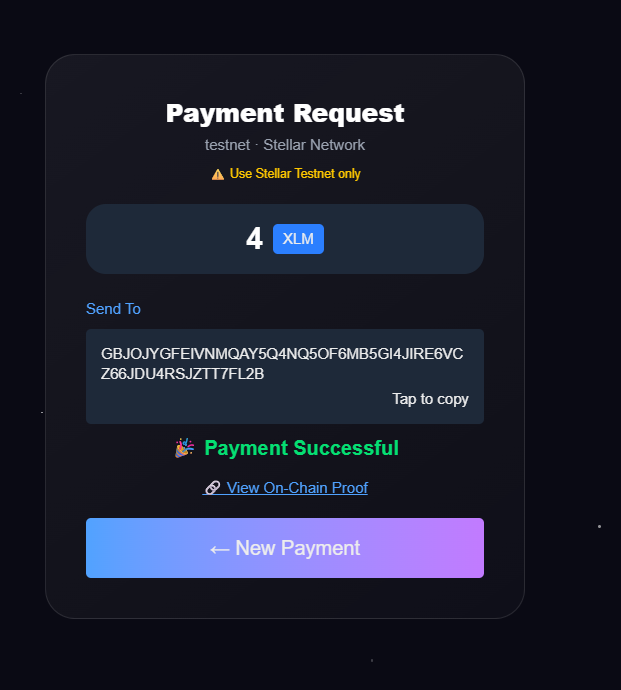
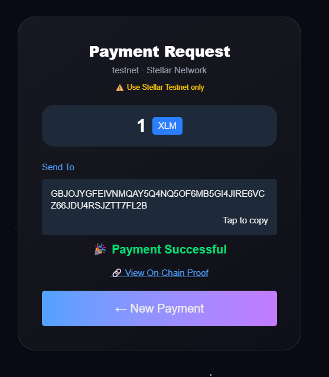
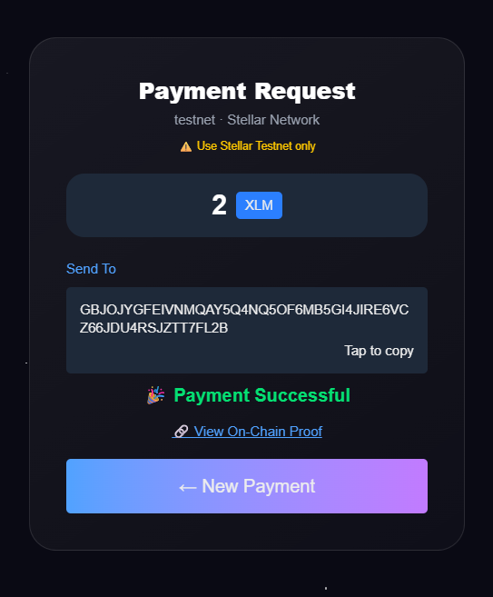
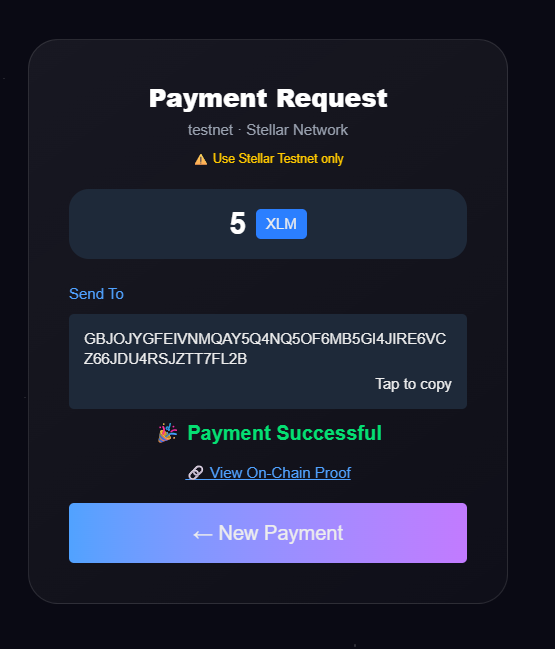

## 📑 Table of Contents

* Overview
* Problem
* Solution
* Key Learnings
* Features
* System Architecture
* Testing Strategy
* Tech Stack
* Security
* Performance
* What Makes This Level 5
* Demo
* How to Run
* User Flow
* Screenshots
* Test Users
* Transaction Proof
* Feedback
* Future Enhancements
* Conclusion

---

## Stellar Merchant POS

## Overview

Stellar Merchant POS is a modern **crypto point-of-sale system** built on the Stellar Network that enables merchants to accept payments in **XLM instantly**.

The application provides a clean and user-friendly interface where merchants can generate payment requests, and customers can pay using their Stellar wallets. The system automatically detects transactions on-chain and confirms payments in real-time.

---

## Problem

Retail stores and small businesses lack simple tools to accept cryptocurrency payments. Existing blockchain solutions are often complex, slow, and not designed for everyday merchant use.

---

## Solution

Stellar Merchant POS simplifies crypto payments by providing:

* Simple and intuitive payment interface
* Instant blockchain verification
* Real-time payment confirmation

This makes crypto payments as seamless as UPI or card transactions.

---

## Key Learnings

* Designing for real users requires simplicity over complexity
* Blockchain UX must feel instant and intuitive
* On-chain transparency significantly improves trust
* Iteration based on feedback is critical for product quality

---

## Features

### Core Features (Level 5)

* Generate payment requests
* Real-time payment detection via Stellar blockchain
* Instant transaction confirmation
* Transaction history display
* Copy wallet address functionality
* Input validation (prevents invalid payments)
* Premium UI (glassmorphism + animated stars)

---

### UX Enhancements

* Animated “Checking Blockchain” loader
* Payment success feedback
* Transaction counter
* Testnet usage warning

---

### Iteration Improvements (Based on Feedback)

* Added copy-to-clipboard wallet feature
* Improved UI clarity and consistency
* Prevented duplicate transaction detection
* Enhanced success message visibility

---

## System Architecture

Frontend (Next.js)
↓
Stellar SDK
↓
Horizon API
↓
Stellar Blockchain
↓
Payment Detection Logic

---

## Architecture Document

📄 [architecture.md](./architecture.md)

---

## Testing Strategy

The application was tested using:

* Multiple real users (5 participants)
* Different transaction amounts
* Repeated transactions to ensure consistency
* On-chain verification via Stellar Expert

### Key Validations

* Payment detection accuracy
* Transaction confirmation speed
* Duplicate transaction prevention
* UI responsiveness and usability

---

## Tech Stack

* **Frontend:** Next.js, React, Tailwind CSS
* **Blockchain:** Stellar Network (Horizon API)
* **Library:** stellar-sdk
* **Wallet:** Freighter Wallet

---

## Security Considerations

* Input validation prevents invalid transaction values
* Transactions are verified directly from the blockchain
* No private keys are stored in the application
* Freighter wallet ensures secure signing

---

## Performance Highlights

* Near-instant transaction confirmation
* Real-time blockchain polling
* Minimal network fees (~0.00001 XLM)
* Fast UI rendering with Next.js

---

## What Makes This a Level 5 Project

* Real users interacting with the application
* Real blockchain transactions (Stellar Testnet)
* End-to-end payment flow implementation
* Strong UI/UX with premium design
* On-chain verification and transparency
* Iterative improvements based on feedback

---

## Live Demo

👉 https://stellar-merchant-pos-uaao.vercel.app/

---

## Demo Video

👉 https://youtu.be/EbWxDq_z3sc

---

## How to Run Locally

```bash
git clone https://github.com/YOUR_USERNAME/YOUR_REPO.git
cd YOUR_REPO
npm install
npm run dev
```

---

## User Flow

1. Merchant enters payment amount
2. Merchant connects Freighter wallet
3. Payment request is generated
4. Customer pays using Stellar wallet
5. System detects transaction on-chain
6. Payment is confirmed instantly
7. Transaction proof is displayed

---

## DApp Preview


---

## Screenshots

### Wallet Connection


### Payment Request


### On-Chain Proof



### Payment Success


---

## Test Users (Stellar Wallets)

| Sr No | Email                                                                   | Account                                                  | XLM   | Link                                                                                                                |
| ----- | ----------------------------------------------------------------------- | -------------------------------------------------------- | ----- | ------------------------------------------------------------------------------------------------------------------- |
| 1     | sujaypalande24022001@gmail.com                                          | GCLHTHMOVW3J6O3IVLZWMWDONMLPONJTR6QSLI2SSBWAKB44IKJE3ES2 | 4 XLM | [View](https://stellar.expert/explorer/testnet/tx/039fe9f84d3870053f1daee4e22145135dafa814a4e8cb03fe3d1f0c0d674501) |
| 2     | cdhasal23@gmail.com                                                     | GDJCKA3JG2BUJO5LJLD66DATXE4HCJG62XPLFJKNJRVQSBA3IPB2BWQ2 | 1 XLM | [View](https://stellar.expert/explorer/testnet/tx/e0c6804ece42cdca09b43c32ef87afc42ebeaa945709a796a9cd8a6cf9fad863) |
| 3     | manashulle@gmail.com                                                    | GBYUTGCNPXOLSHPZ6SCJQCCS3GSYLE2MXQQO6DFUQ2E7G4Y4NKSL2PFQ | 2 XLM | [View](https://stellar.expert/explorer/testnet/tx/e73b3d1d1618c134b0759735ba989975f59954e33de2d7e15d55277734dc8cb0) |
| 4     | jpalande0702@gmail.com                                                  | GDRWXCQ3IN3ZFXOKIPICFI2D7GERUQ4GEGISRGWND5VHQCXLO54YZ3JK | 5 XLM | [View](https://stellar.expert/explorer/testnet/tx/a3b762f938268320135f06e6ae8a13aa5bb35795fe4678d782672b81c443d4ec) |
| 5     | prachidhasal1612@gmail.com                                              | GCLTDFYMDJZYLDKETB6Z24CCPHGFQS7NRZFJWT4AUXQZ5SF2BJOME7CN | 1 XLM | [View](https://stellar.expert/explorer/testnet/tx/cfad61525f39202b91244e7e480ea63f7c75188af733ffae801b086fef1ff32c) |

---

## Transaction Proof (Testnet)

### User 1 (4 XLM)



### User 2 (1 XLM)



### User 3 (2 XLM)



### User 4 (5 XLM)



### User 5 (1 XLM)


---
 ## Google form Sheet 
 https://docs.google.com/spreadsheets/d/1GCcOLU0w7fN5MzbbGdaaemjKCHi3yrzK8WBL43L-OSw/edit?resourcekey=&gid=637474215#gid=637474215

## Improvements Based on Feedback

* Added “Tap to Copy” wallet feature
* Improved success message visibility
* Added testnet usage warning
* Enhanced UI responsiveness

---

## Why This Project Matters

This project demonstrates real-world adoption of blockchain in retail.

Unlike theoretical projects, this MVP:

* Has real users
* Processes real blockchain transactions
* Solves a practical business problem

---

## Future Enhancements (Level 6)

* Analytics dashboard (revenue, transactions)
* Multi-merchant support
* Fee sponsorship (gasless payments)
* Multi-signature payment approval
* Cross-border payments
* Real-time transaction streaming (WebSockets)
* Database integration (Supabase)
* User analytics (DAU, retention)

---

## Note

This project uses **Stellar Testnet only**.
No real funds are involved.

---

## Conclusion

Stellar Merchant POS showcases how blockchain can power real-world retail payments with speed, security, and simplicity.

---
