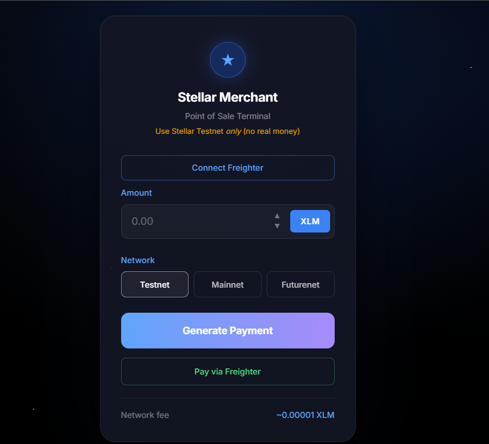
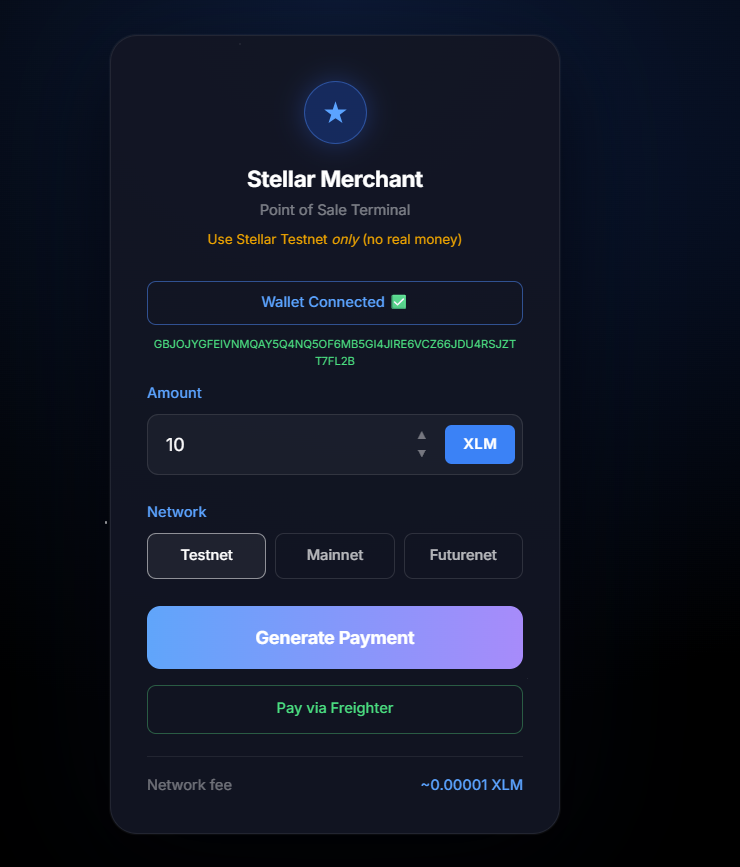
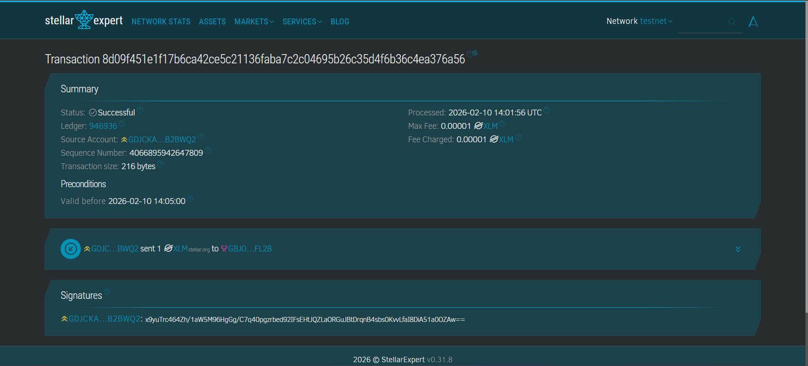

#  Stellar Merchant POS

##  Overview

Stellar Merchant POS is a modern **crypto point-of-sale system** built on the Stellar Network that enables merchants to accept payments in **XLM instantly**.

The application provides a clean and user-friendly interface where merchants can generate payment requests, and customers can pay using their Stellar wallets. The system automatically detects transactions on-chain and confirms payments in real-time.

---

##  Problem

Retail stores and small businesses lack simple tools to accept cryptocurrency payments. Existing blockchain solutions are often complex, slow, and not designed for everyday merchant use.

---

##  Solution

Stellar Merchant POS simplifies crypto payments by providing:

-  Simple and intuitive payment interface  
-  Instant blockchain verification  
-  Real-time payment confirmation  

This makes crypto payments as seamless as UPI or card transactions.

---

##  Features

###  Core Features (Level 5)

- Generate payment requests  
- Real-time payment detection via Stellar blockchain  
- Instant transaction confirmation  
- Transaction history display  
- Copy wallet address functionality  
- Input validation (prevents invalid payments)  
- Premium UI (glassmorphism + animated stars)

---

###  UX Enhancements

- Animated “Checking Blockchain” loader  
- Payment success feedback  
- Transaction counter  
- Testnet usage warning  

---

###  Iteration Improvements (Based on Feedback)

- Added copy-to-clipboard wallet feature  
- Improved UI clarity and consistency  
- Prevented duplicate transaction detection  
- Enhanced success message visibility  

---

##  System Architecture

Frontend (Next.js)
↓
Stellar SDK
↓
Horizon API
↓
Stellar Blockchain
↓
Payment Detection Logic

---

##  Architecture Document

Detailed system design available here:  
 [architecture.md](./architecture.md)

---

## Tech Stack

- **Frontend:** Next.js, React, Tailwind CSS  
- **Blockchain:** Stellar Network (Horizon API)  
- **Library:** stellar-sdk  
- **Wallet:** Freighter Wallet  

---

##  Live Demo

 https://your-app.vercel.app

---

## Demo Video

 https://your-video-link

---

##  Screenshots

###  Home Page

###  Wallet Connection

###  Payment Request

###  On-Chain Proof

###  Payment Success

---

##  Test Users (Stellar Wallets)

 All wallets have successfully completed transactions on Stellar Testnet.

1. GXXXXXXXXXXXX1  
2. GXXXXXXXXXXXX2  
3. GXXXXXXXXXXXX3  
4. GXXXXXXXXXXXX4  
5. GXXXXXXXXXXXX5  

 Transactions can be verified on:  
https://stellar.expert/explorer/testnet

---

##  User Feedback

- **User 1:** Easy to use and clean UI  
- **User 2:** Payment confirmation is fast  
- **User 3:** Suggested adding copy wallet button  
- **User 4:** UI looks modern and professional  
- **User 5:** Wanted clearer instructions for testnet  

---

## Improvements Based on Feedback

- Added “Tap to Copy” wallet feature  
- Improved success message visibility  
- Added testnet usage warning  
- Enhanced UI responsiveness  

---

##  Why This Project Matters

This project demonstrates real-world adoption of blockchain in retail.

Unlike theoretical projects, this MVP:

-  Has real users  
-  Processes real blockchain transactions  
-  Solves a practical business problem  

It bridges the gap between crypto and everyday commerce.

---

##  Future Enhancements (Level 6)

- Analytics dashboard (revenue, transactions)  
- Multi-merchant support  
- Fee sponsorship (gasless payments)  
- Multi-signature payment approval  
- Cross-border payments  
- Real-time transaction streaming (WebSockets)  
- Database integration (Supabase)  
- User analytics (DAU, retention)  

---

##  Note

This project uses **Stellar Testnet only**.  
No real funds are involved.

---

##  Conclusion

Stellar Merchant POS showcases how blockchain can power real-world retail payments with speed, security, and simplicity.

---